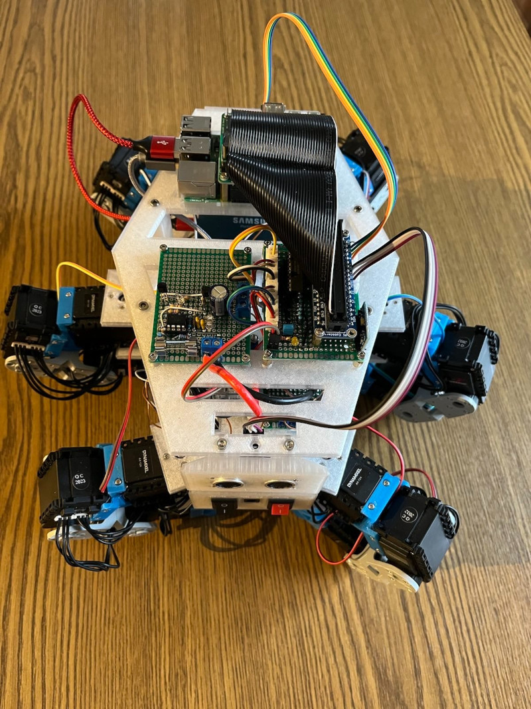

# A hexapod robot
The aim of this little project is the creation of a fully self-designed and 3d printed hexapod robot. Basic features:

* 6 legs with 3 Dynamixel motors each
* Controls and feedback through Raspberry-Pi
* Plastic parts self-designed and 3d printed
* Modular design
* Battery or cable driven
* Sensors:
    * pressure sensors in the feeds
    * ultrasonic sensors
    * gyroscopic sensor

The longer term goal is to equip this robot with various additional sensors, giving feedback about the environment and orientation of the robot.

## Hardware
A description of the hardware can be found in in the [hardware folder](hardware/README.md).

## Software
The (still PoC level) software is available [here](software/README.md).
