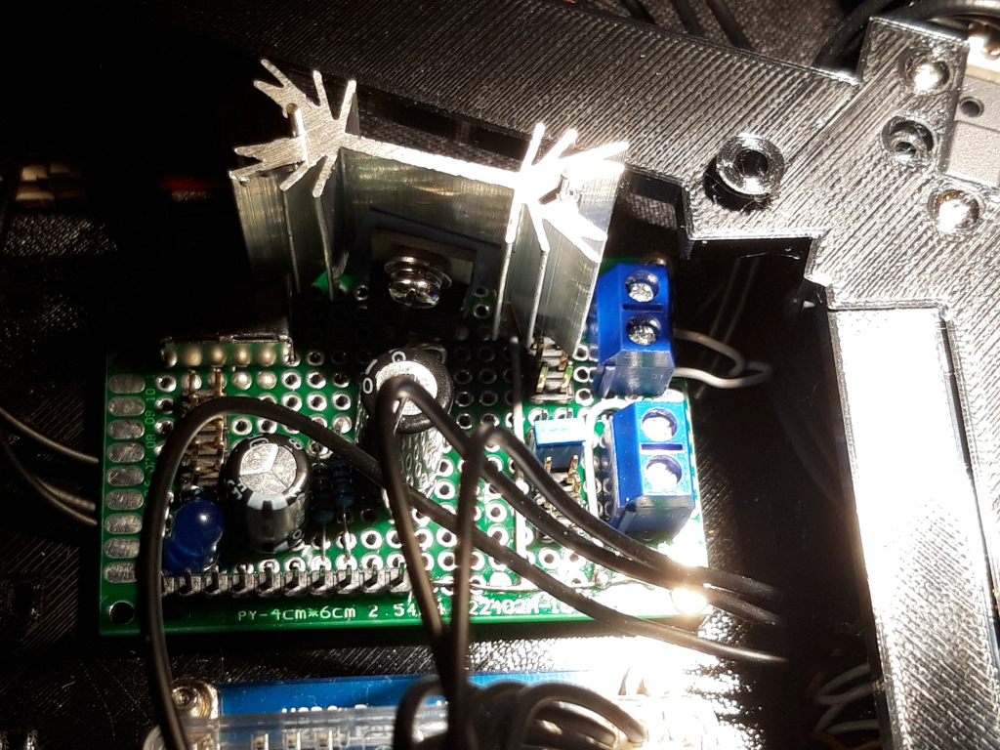

# Hardware bits
## 3d-printed parts
OpenScad has been used to design the 3d printed parts for this robot. Source files are in the scad folder. These may change at any time and might not work as expected.

The stl folder contains the latest released versions of the plastic parts in STL format, which can be used with your favorite slicer. The intention is to keep them more stable than the source OpenScad files above.

## Required parts list for the robot
Plastic parts:

* 6 legs (6x leg.stl)
* 1x bodybottom.stl
* 1x bodytop.stl
* 5x connector_boxes.stl
* 1x side_buttons.stl
* 1x side_power.stl

Other parts and materials
* 18 Dynamixel AX-12A kits (we need the screws and plastic parts available in these kits as well)
* 13x Molex P3 plugs
* 10x 10cm p3 cables from Robotis
* perfboard, cutable into pieces

Screws:
* M2 (10mm) screws and M2 nuts to mount the legs
* M2.5 (8mm) screws, nuts and washers
* M3 screws and washers

## Electronics
* 1x Robotis U2D2 board
* 1x Raspberry-Pi 4 with 16GB or 32GB SSD car
* 1x Voltage converter 12V -> 5V 3A, see below

### Voltage converter
A voltage converter is used to provide the required 5V power used by the Raspberry-Pi. The 5V output current is provided via a USB plug, and a short USB 2 to USBC cable is used to connect the two.

For the voltage converter is built on a PCB perfboard with dimensions 40x60mm. The regulator IC needs an sufficiently sized heat sink.Using a voltage converter has the advantage that a single power supply of 12V can be used to power the hole robot. In a later version, this may be replaced by a 11.2V Lithium Polymere battery.
Here's a close-up image of how it looks like in reality:

