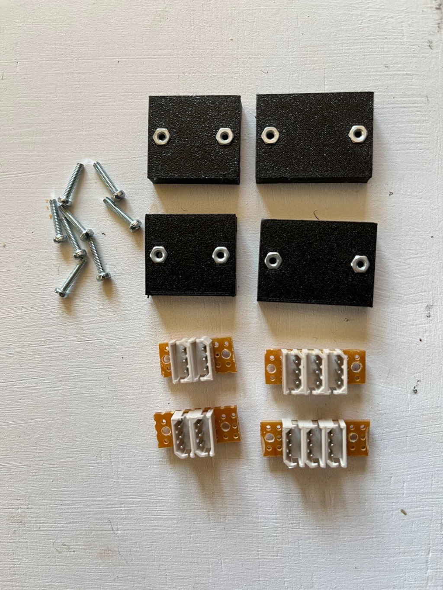
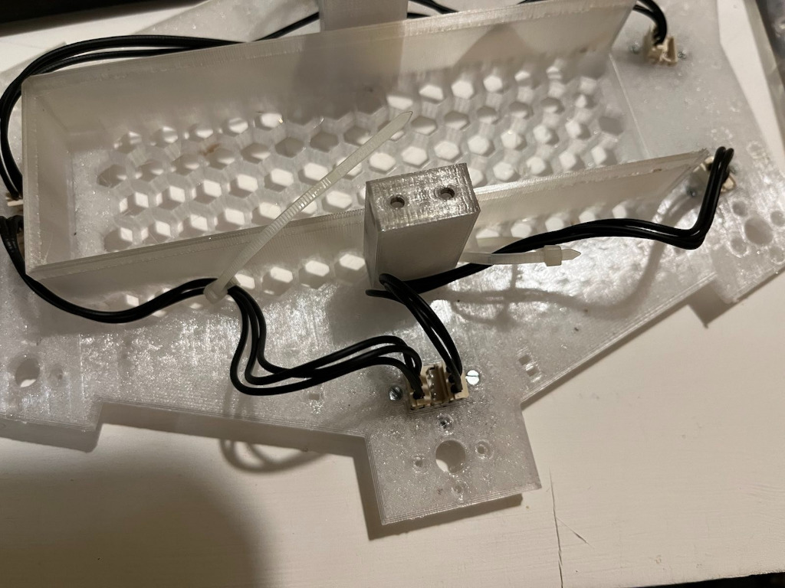
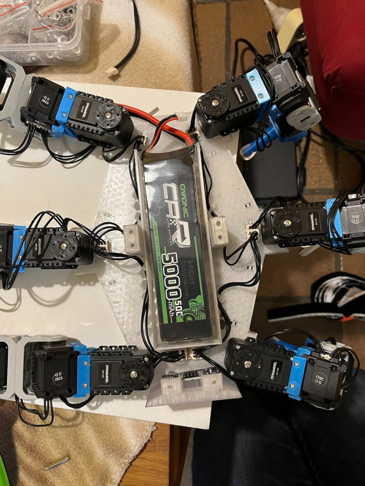
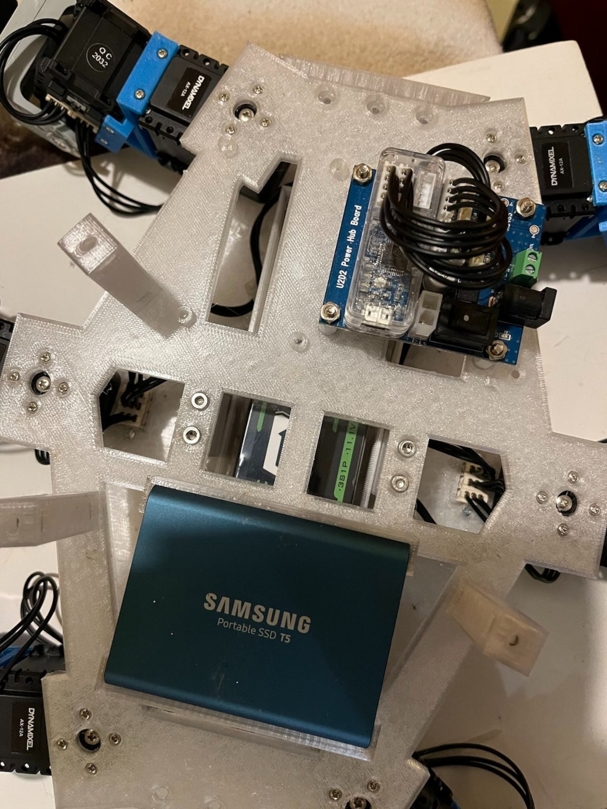

# Hardware parts
## 3d-printed parts
OpenScad has been used to design the 3d printed parts for this robot. Source files are in the scad folder. These may change at any time and might not work as expected.

The stl folder contains the latest released versions of the plastic parts in STL format, which can be used with your favorite slicer. The intention is to keep them more stable than the source OpenScad files above.

## Required parts list for the robot
Plastic parts: Most up-to-date are the source files for OpenSCAD.

### Legs
* ./legs/joint_30_degrees.scad
* ./legs/leg_connector_boxes_side.scad
* ./legs/sensorunit_bottom.scad
* ./legs/sensorunit_middle.scad
* ./legs/sensorunit_top.scad
* ./legs/leg_connector_boxes.scad

### Body
The body part has 3 different layers, which are:

* ./body/bodybottom.scad
* ./body/bodymiddle.scad
* ./body/bodytop.scad

These are connected using the mount parts

* ./body/mount2.scad
* ./body/mount.scad

The lowest layer hosts the connectors for the motors. For each motor connector, an appropriate connector box is needed:
* ./body/connector_boxes.scad

Finally the body sides are moduler. Currently existing are:
* ./body/side_sensor.scad for the ultrasonic sensors
* ./body/side_power.scad  contains holes for switches
* ./body/side_battery.scad contains holes for the battery connectors

## Electronics:

* 18 Dynamixel AX-12A kits (we need the screws and plastic parts available in these kits as well)
* 1x Raspberry-pi 4b
* 1x Strompi board (Joy-IT)
* 1x Robotis U2D2 board and power distributior
* 2x HC-SR04 Ultrosonic sensors
* 1x MPU6050 sensor
* ADC0838 IC
* LiPo battery, cables and connectors and suitable charger
* 512GB external SSD disk
* 1x voltage converter 12V -> 5V 3A, see circuit diagram
* 1x voltage control board, see circuit diagram below
* 1x ADC board, see circuit diagram below
* 6x RP-C10-ST pressure sensores for the legs

Other parts and materials

* 15x Molex P3 plugs
* 10x 10cm p3 cables from Robotis
* perfboard, cutable into pieces
* 2 small USB cables
* cables, crimp tool, and 4 and 2 pin plugs are needed to connect the sensors

Screws: hexagonal heads, various lengths. These sizes have been used:

* M1.4 (10mm) screws and nuts, at least 8 to fix the HC-SR04 sensors
* M2 (10mm) screws and M2 nuts to mount the legs
* M2.5 (8mm) screws, nuts and washers
* M3 screws and washers

### Motor connectors
Connecting the motors is a bit tricky due to the length of the available cables.
Therefore, in front of roughly each leg there we added additional P3 plugs which help reducing the cable lengths.
The bottom part of the robot has holes forseen for these hubs. To create them, the Molex P3 plugs are soldered on small bits of a PCB perfboard, 3 in pairs of 3 and 2 in pairs of 2 are needed. The pins are to be paired up, like this:

This picture shows the parts needed to create those boxes:

The plugs are then inserted into the holes into the bottom part of the robot from below, and fixed with screws with the help of the printed connector boxes. A power distirbution hub seen from below the robot looks like this:

Cabling is done as in the following figure. The still empty plugs are used to connect the legs.

## Voltage converter
A voltage converter is used to provide the required 5V power used by the Raspberry-Pi. The 5V output current is provided via a USB plug, and a short USB 2 to USBC cable is used to connect the two.

The converter is used as power supply for the sensors mainly, to offload the StromPi. As it may not be strictly needed it is possible that it will be dropped in the future.

For the voltage converter is built on a PCB perfboard with dimensions 40x60mm. The regulator IC needs an sufficiently sized heat sink.Using a voltage converter has the advantage that a single power supply of 12V can be used to power the hole robot. In a later version, this may be replaced by a 11.2V Lithium Polymere battery.

Here's a close-up image of how it looks like in reality:

## Voltage controller
The voltage controller is needed to have some control over the status of the battery. It has 2 LEDs, and if the voltage drops too low, a red light will indicate that it is time to recharge the battery.

## ADC board
The ADC board uses an ADC0838 chip to digitize the signals from the pressure sensors in the feets of the robot.

## Layers

### Lowest layer
The first layer takes the motor cabling, as described above, and the battery. The battery should be fixed so that it cannot move or slip out of the robot. A piece of hook-and-loop tape can be used to accomplish this.

### Second layer
The second layer takes the SSD disk for the Raspberry-pi, the U2D2 board and optionally the 5V power converter.

### Top layer
The top layer takes the electronics for the sensors, the Raspberry-Pi, and the power control board.

